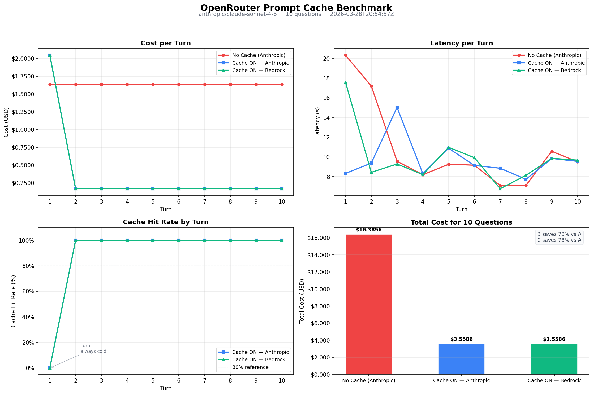

# We Spent $16 Asking the Same Codebase 10 Questions. Then We Spent $3.56.


*Hero image generated with Nano Banana Pro*

Here's the thing nobody tells you about building with large language models: you're almost certainly paying to re-read the same text over and over again.

Every time you send a request to an LLM, the model processes your entire input — system prompt, context, conversation history, all of it — from scratch. If you're building something like a code review assistant, a customer support agent, or a RAG pipeline, you're probably stuffing the same giant document or system prompt into every single call. And you're paying for it every single time.

Anthropic's prompt caching changes this. You mark a chunk of your context as cacheable, the API stores it server-side, and subsequent calls that reference that chunk skip the re-encoding step entirely. You pay a fraction of the normal price, and the model gets to the answer faster.

But how much does it actually matter? We ran the numbers.

---

## The Experiment

We took the [OpenRouter Python SDK](https://github.com/OpenRouterTeam/python-sdk) — all its source files concatenated into a single string — and used it as a system prompt for a code review assistant. Then we asked 10 code review questions against it in sequence, three times over, with different caching configurations each time.

The context came out to **544,685 tokens**. That's not a contrived example — any real codebase, documentation site, or large policy document is going to be in this range.

The three runs:

| Run | Provider | Caching |
|-----|----------|---------|
| **A** | Anthropic (direct) | Off |
| **B** | Anthropic (direct) | On |
| **C** | Amazon Bedrock | On |

Everything else was identical: same model (`claude-sonnet-4-6`), same 10 questions, same `max_tokens`. The only variable was whether we added `cache_control` to the system message.

All three runs were routed through [OpenRouter](https://openrouter.ai), which gives us a single API to switch providers with one line.

---

## How Caching Works

Before the results, a quick mental model. Without caching, every request looks like this:


With caching, the first call writes the large context block to a server-side store. Every subsequent call within the TTL window reads from that store instead of re-encoding.

The implementation is a single field added to your system message content:

```python
system_content = [
    {
        "type": "text",
        "text": f"You are a code review assistant. Here is the codebase:\n\n{codebase}",
        "cache_control": {"type": "ephemeral"}  # ← this is the entire change
    }
]
```

That's it. One field. The rest of your API call is unchanged.

The pricing model is straightforward: cache writes cost 25% more than a normal input token. Cache reads cost about 90% less. So Turn 1 is slightly more expensive than usual — you're paying the write premium — and every subsequent turn is dramatically cheaper.

---

## The Results

### Cost

This is where it gets interesting.

| Run | Total (10 questions) | Per question (cached) |
|-----|---------------------|----------------------|
| A — No Cache | **$16.39** | $1.64 each |
| B — Cache ON, Anthropic | **$3.56** | $0.17 each (turns 2–10) |
| C — Cache ON, Bedrock | **$3.56** | $0.17 each (turns 2–10) |

**78% cost reduction.** Runs B and C spent $3.56 to answer all 10 questions versus $16.39 for Run A.

The savings compound immediately. Turn 1 of Run B cost *more* than Turn 1 of Run A ($2.05 vs $1.64) — that's the cache write premium. But from Turn 2 onward, each question dropped from $1.64 to $0.17. By Turn 3, Run B had already made back the write premium.

At any meaningful scale — hundreds of users, thousands of queries per day — this difference is not academic. It's the difference between a sustainable product and a billing nightmare.



### Cache Hit Rate

Runs B and C both hit **100% cache hit rate from Turn 2 onward**. Every single one of the 544,671 context tokens was read from cache rather than re-encoded.

Turn 1 is always a miss — that's unavoidable. The cache doesn't exist until you write to it. Think of it as a one-time setup cost.

### Latency

Here's the honest finding: latency improvement was modest — about 10% on average.

| Run | Avg Latency |
|-----|------------|
| A — No Cache | 10.8s |
| B — Cache ON, Anthropic | 9.7s |
| C — Cache ON, Bedrock | 9.9s |

We expected a bigger gap. The reason it's small is that at 300 output tokens, generation time dominates. The model still has to write the full answer. Caching saves the *input processing* step, which is fast relative to output generation at this context size.

If you're generating longer outputs or your context is smaller, the latency improvement will be more pronounced. For our benchmark, cost savings are the main story.

### Anthropic vs. Bedrock

Runs B and C were nearly identical in both cost and hit rate. If you're already using Amazon Bedrock for infrastructure or compliance reasons, you're not giving up anything on caching performance.

---

## Validating It's Actually Working

The `cached_tokens` field in the usage response is your ground truth:

```python
response = client.chat.completions.create(
    model="anthropic/claude-sonnet-4-6",
    messages=[...],
    extra_body={"provider": {"order": ["Anthropic"], "allow_fallbacks": False}},
)

usage = response.usage
cached = usage.prompt_tokens_details.cached_tokens
print(f"Cached: {cached:,} / {usage.prompt_tokens:,} tokens")
# Turn 1:  Cached:       0 / 544,685 tokens
# Turn 2:  Cached: 544,671 / 544,691 tokens  ✅
```

If `cached_tokens` is 0 on Turn 2 and beyond, the `cache_control` field isn't reaching the API and you're paying full price without knowing it. OpenRouter's [activity log](https://openrouter.ai/workspaces/default/observability) shows this per-request so you can verify without adding any extra instrumentation.

---

## When to Use This

Caching is worth considering any time you have a large chunk of context that stays constant across multiple calls. Common patterns:

**Code review or Q&A tools** — the codebase or documentation is the same for every question. This benchmark is almost exactly this use case.

**Multi-turn chat with a long system prompt** — put the cache breakpoint at the end of your system instructions. Each new user message doesn't invalidate the cached system prompt.

**RAG with a fixed knowledge base** — if your retrieved chunks are deterministic and stable, cache them.

The breakpoint placement matters. You want it at the *end* of the stable content. Anything after the breakpoint isn't cached, so putting it too early leaves tokens on the table.

---

## Reproducing This

All the code is at [github.com/context-window-ai/cache-hit-demo](https://github.com/context-window-ai/cache-hit-demo). You need an OpenRouter API key and Python 3.11+.

```bash
git clone https://github.com/context-window-ai/cache-hit-demo
cd cache-hit-demo

cp .env.example .env   # add OPENROUTER_API_KEY

bash scripts/generate_context.sh   # builds codebase_context.txt
python benchmark.py                # runs all three sessions (~6–8 min)
python visualize.py                # generates the chart
python generate_blog.py            # produces a draft post with your real numbers
```

The benchmark takes 6–8 minutes end to end. Results land in `results/` as JSON plus a chart.

---

## The Short Version

Prompt caching is one change — one field in your API call — that cut costs by 78% in a real benchmark on a real codebase. The mechanism is simple, the implementation is trivial, and the savings start from the second request.

If you're running anything with a large, stable context and you're not using `cache_control`, you're leaving money on the table.

---

*Built by [context-window-ai](https://github.com/context-window-ai) · [Repo](https://github.com/context-window-ai/cache-hit-demo) · Questions and PRs welcome*
